Dette er et arbeidsutkast til undervisningen knyttet til Anderson kapittel 3.
Materialet er tenkt brukt over to undervisningsganger, med to arbeidsøkter på omtrent 45 minutter hver.
Målet er å holde hovedteksten kort: fundamentale definisjoner og teoremer står her,
mens mange forklaringer, bevis og eksempler undersøkes i oppgaver og med KI.

Vi skal særlig arbeide med fire spørsmål:

1. Hvordan beskriver vi grafer presist, og hvordan uttrykker vi sammenheng?
2. Hvordan finner vi spenntrær, og hva betyr det egentlig at en algoritme er rask?
3. Hvorfor hører plane grafer, sfæren og Eulers formel sammen?
4. Hvordan leder dette videre til Kuratowskis teorem, dualitet og firefargeproblemet?

::: {.callout-note title="Om KI-oppgavene"}
Når du bruker KI, er målet ikke bare å få et svar.

- Bruk KI til et avgrenset formål: et hint, en forklaring, et bevis, et eksempel eller hjelp til å lese dokumentasjon eller kildekode.
- Kontroller minst ett viktig matematisk eller algoritmisk steg selv.
- Når oppgaven gjelder hva et programvarebibliotek faktisk gjør, skal du kontrollere svaret mot offisiell dokumentasjon eller kildekode.
- En overbevisende formulering fra en KI er ikke i seg selv en begrunnelse.
:::

::: {.callout-note title="Figurer i dette arbeidsutkastet"}
Bokser merket **Figurforslag (SVG)** markerer steder der vi ønsker enkel vektorgrafikk.
De skal erstattes av faktiske SVG-figurer når innhold og rekkefølge er på plass.
Når samme graf brukes flere steder, bør hjørnene ha samme plassering slik at figuren er lett å kjenne igjen.
:::

## Arbeidsøkt 1: Grafer, sammenheng og trær

### Grafer

::: {#def-graf name="Enkel graf"}
En **enkel graf** er et par

$$
G=(V,E),
$$

der $V$ er en mengde av **hjørner**, og

$$
E\subseteq \bigl\{\{u,v\}:u,v\in V,\ u\neq v\bigr\}.
$$

Elementene $e=\{u,v\}\in E$ kalles **kanter**, og $u$ og $v$ er endepunktene til kanten $e$.
:::

En enkel graf $G=(V,E)$ kalles **endelig** dersom $V$ er endelig.

Siden $\{u,v\}=\{v,u\}$, har kantene ingen retning.

::: {.content-visible when-format="html"}
::: {.light-content}
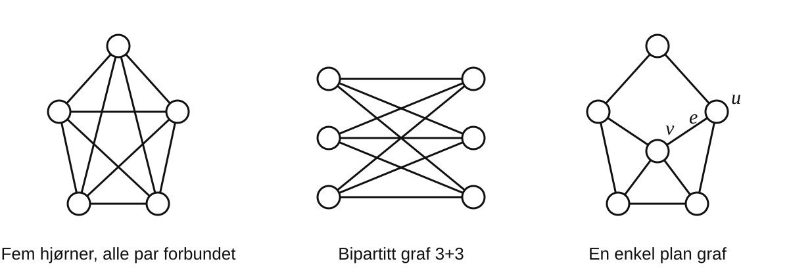{width=100%}
:::

::: {.dark-content}
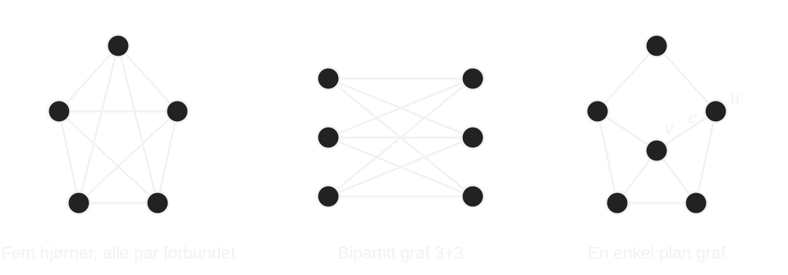{width=100%}
:::
:::

::: {.content-visible when-format="pdf"}
{width=100%}
:::

To hjørner er **naboer** dersom de er endepunktene til samme kant.
Graden $\deg(v)$ til et hjørne $v$ er antallet kanter som har $v$ som endepunkt.

::: {#def-delgraf name="Delgraf"}
La $G=(V,E)$ være en graf. En graf $H=(W,F)$ er en **delgraf** av $G$ dersom

$$
W\subseteq V,\qquad F\subseteq E,
$$

og begge endepunktene til hver kant i $F$ ligger i $W$.
:::

::: {.content-visible when-format="html"}
::: {.light-content}
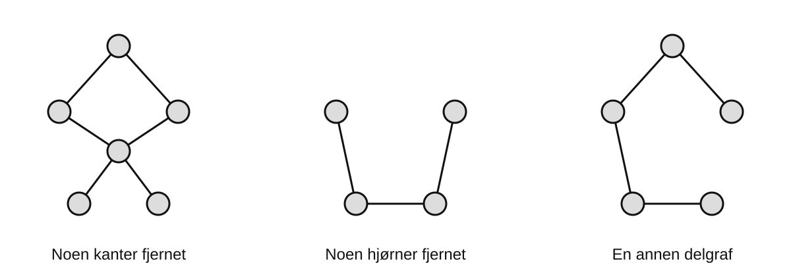{width=100%}
:::

::: {.dark-content}
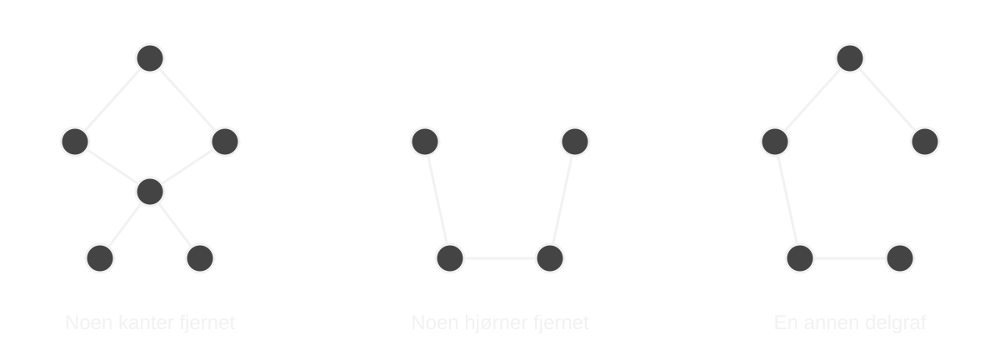{width=100%}
:::
:::

::: {.content-visible when-format="pdf"}
{width=100%}
:::

::: {#exr-handtrykk-oppdag name="Tell endepunkter på to måter"}
Tegn en endelig enkel graf med minst seks hjørner og minst åtte kanter.

1. Finn graden til hvert hjørne.
2. Summer alle gradene.
3. Sammenlign summen med antallet kanter.
4. Forklar hvorfor det du observerer må gjelde for enhver endelig enkel graf.
:::

::: {#thm-handtrykk name="Håndtrykkslemmaet"}
For enhver endelig enkel graf $G=(V,E)$ gjelder

$$
\sum_{v\in V}\deg(v)=2|E|.
$$
:::

Håndtrykkslemmaet er et eksempel på **dobbelttelling**: begge sider teller de samme
kantendepunktene.

### Gang, sti, sykel og sammenheng

::: {#def-gang-sti-sykel name="Gang, sti og sykel"}
En **gang** fra $v_0$ til $v_k$ er en følge

$$
v_0,e_1,v_1,e_2,\ldots,e_k,v_k,
$$

der $e_i=\{v_{i-1},v_i\}$ for hvert $i$.

En **sti** er en gang uten gjentatte hjørner.
En **sykel** er en lukket gang med minst tre kanter som, bortsett fra at første og siste
hjørne er det samme, ikke gjentar hjørner.
:::

::: {.callout-note title="Figurforslag (SVG)"}
`figures/grafer/gang-sti-sykel.svg`: Én underliggende graf med tre små paneler som fremhever henholdsvis

- en gang som gjentar et hjørne,
- en sti,
- en sykel.

Bruk samme hjørneplassering i alle panelene.
:::

::: {#def-sammenheng name="Sammenhengende graf"}
En graf er **sammenhengende** dersom det finnes en sti mellom ethvert par av hjørner.
:::

::: {#exr-sammenheng-gang name="Sti eller gang?"}
En annen mulig definisjon sier at en graf er sammenhengende dersom det finnes en **gang**
mellom ethvert par av hjørner.

1. Vis at de to definisjonene er ekvivalente.
2. Hvis en gang gjentar et hjørne, hvordan kan du gjøre gangen kortere uten å endre start- og endepunkt?
3. Hvilken definisjon synes du er mest direkte eller enklest å bruke? Begrunn svaret.

**KI:** Hvis du står fast, be KI forklare hvordan man går fra en gang til en sti.
Kontroller deretter selv at argumentet virkelig terminerer.
:::

### Trær og skoger

::: {#def-tre name="Tre"}
Et **tre** er en sammenhengende graf uten sykler.
:::

En **skog** er en graf uten sykler. Hver sammenhengskomponent i en skog er altså et tre.

::: {.content-visible when-format="html"}
::: {.light-content}
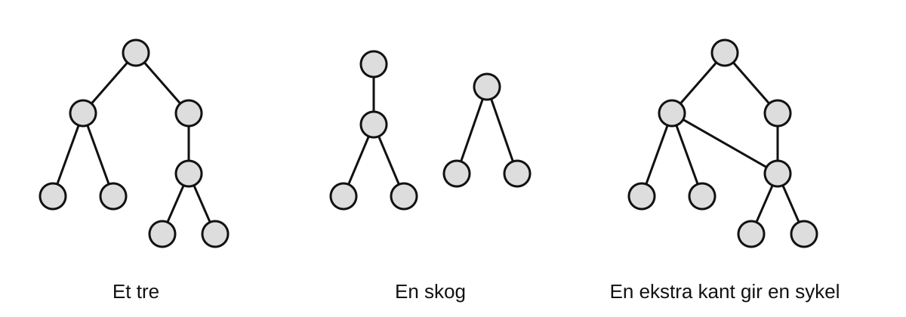{width=100%}
:::

::: {.dark-content}
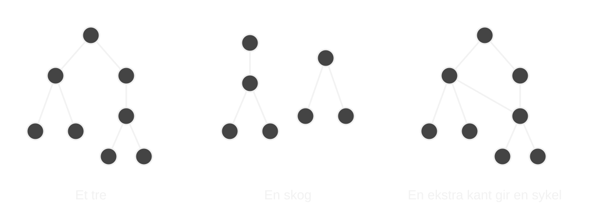{width=100%}
:::
:::

::: {.content-visible when-format="pdf"}
{width=100%}
:::

Følgende karakteriseringer er fundamentale og lar oss skifte mellom geometriske,
kombinatoriske og algoritmiske beskrivelser av trær.

::: {#thm-tre-karakterisering name="Karakteriseringer av trær"}
La $T$ være en endelig enkel graf med $n$ hjørner. Følgende utsagn er ekvivalente:

1. $T$ er et tre.
2. Mellom hvert par av hjørner finnes nøyaktig én sti.
3. $T$ er sammenhengende og har $n-1$ kanter.
4. $T$ har ingen sykler og har $n-1$ kanter.
:::

::: {#exr-tre-bevis name="KI: Bygg et bevis av små deler"}
Velg én av implikasjonene i @thm-tre-karakterisering.

1. Forsøk først å forklare hvorfor implikasjonen burde være sann.
2. Be så KI om et kort bevis.
3. Finn det viktigste stedet der hypotesen brukes.
4. Skriv beviset med egne ord i høyst fem setninger.

Målet er ikke å memorere et langt standardbevis, men å forstå hvorfor karakteriseringene henger sammen.
:::

## Arbeidsøkt 2: Spenntrær og algoritmer

### Spenntrær

La $G=(V,E)$ være en sammenhengende enkel graf. Et **spenntre** i $G$ er en delgraf

$$
T=(V,F)
$$

som er et tre. Legg merke til at et spenntre inneholder alle hjørnene i $G$.

### Vektede grafer og minimum spenntrær

En **vektet graf** er en graf $G=(V,E)$ sammen med en funksjon

$$
w:E\longrightarrow \mathbb R.
$$

Tallet $w(e)$ kalles **vekten** til kanten $e$. Vekten kan for eksempel representere avstand,
kostnad eller tid.

La nå $G=(V,E)$ være en **endelig**, sammenhengende vektet enkel graf, og la
$T=(V,F)$ være et spenntre i $G$. Den **totale vekten** til $T$ er den endelige summen

$$
w(T)=\sum_{e\in F}w(e).
$$

Et **minimum spenntre** (MST) er et spenntre med minst mulig total vekt.

::: {.callout-note title="Figurforslag (SVG)"}
`figures/grafer/spenntre.svg`: En liten vektet graf og samme graf ved siden av med ett spenntre markert.
Alle hjørnene skal stå på samme sted i begge bilder; bare de valgte kantene fremheves i spenntreet.
Bruk denne samme vektede grafen også i figurene for Kruskal og Prim dersom den egner seg.
:::

To klassiske algoritmer er:

**Kruskal:** Sorter kantene etter stigende vekt. Gå gjennom dem i denne rekkefølgen,
og legg til en kant dersom den ikke danner en sykel med kantene som allerede er valgt.

**Prim:** Start i ett hjørne. Legg gjentatte ganger til en kant med minst mulig vekt
som forbinder treet som hittil er bygget med et nytt hjørne.

::: {.callout-note title="Figurforslag (SVG)"}
Bruk én og samme vektede graf til to stegserier.

- `figures/grafer/kruskal-steg.svg`: 4--5 små paneler der skogen vokser. Vis minst én kant som avvises fordi den ville danne en sykel.
- `figures/grafer/prim-steg.svg`: 4--5 små paneler fra et markert starthjørne der ett sammenhengende tre vokser.

Samme graf, samme hjørneplassering og samme vekter i begge serier skal gjøre kontrasten tydelig.
:::

::: {#exr-kruskal-prim name="Samme problem, to strategier"}
Bruk begge algoritmene på den vektede grafen med hjørner

$$
\{A,B,C,D,E,F\}
$$

og kanter og vekter

$$
\begin{array}{c|cccccccccc}
\text{kant} & AB & AC & BC & BD & CD & BE & CE & DE & DF & EF\\
\hline
\text{vekt} & 4 & 2 & 1 & 5 & 8 & 7 & 10 & 2 & 6 & 3
\end{array}
$$

1. Hvilke kanter velger Kruskal, og i hvilken rekkefølge?
2. Kjør Prim med start i $A$.
3. Får algoritmene samme spenntre?
4. Hva kan skje dersom flere kanter har samme vekt?
:::

### Er sykeltesten i Kruskal dyr?

Når Kruskal har valgt noen kanter, danner de en skog. Når algoritmen vurderer kanten $uv$,
trenger den egentlig bare å vite om $u$ og $v$ allerede ligger i samme sammenhengskomponent
av denne skogen.

::: {#exr-union-find name="Fra sykeltest til union--find"}
Anta at vi hele tiden holder orden på komponentene i skogen.

1. Forklar hvorfor kanten $uv$ danner en sykel akkurat når $u$ og $v$ allerede ligger i samme komponent.
2. Hvilke to operasjoner trenger vi på komponentene?
3. Undersøk datastrukturen **union--find** (disjoint-set union, DSU).
4. Be KI forklare *union by rank/size* og *path compression*. Tegn selv et lite eksempel som viser hva operasjonene gjør.
5. Forklar hvorfor Andersons sykeltest ikke nødvendigvis er den kostbare delen av Kruskals algoritme.
:::

Her bruker vi $O$-notasjon for å beskrive hvordan kjøretiden vokser når input blir større.
Hvis notasjonen er ny for deg, les først det [korte notatet om $O$-notasjon](o-notasjon.qmd).

Med en vanlig sammenligningssortering og union--find får Kruskal typisk kjøretid

$$
O(|E|\log |E|),
$$

mens Prim med en binær heap typisk får

$$
O(|E|\log |V|).
$$

::: {#exr-prim-vs-kruskal name="Er Prim virkelig raskere enn Kruskal?"}
Undersøk påstanden «Prim er raskere enn Kruskal».

Diskuter minst disse spørsmålene:

1. Hvor stor forskjell er det egentlig mellom $\log |E|$ og $\log |V|$ for en enkel graf?
2. Hva skjer hvis kantene allerede er sortert?
3. Hvordan påvirker det sammenligningen om grafen er lagret som kantliste, nabolister eller matrise?
4. Hva forventer du for svært sparsomme og svært tette grafer?
5. Hvilke konstante faktorer skjuler $O$-notasjonen?

**KI:** Be gjerne KI foreslå hypoteser, men krev at den oppgir hvilken datastruktur og inputrepresentasjon den antar.
:::

### Hva bruker stabile programvarebiblioteker?

::: {#exr-mst-biblioteker name="Fra lærebok til programvare som faktisk brukes"}
Arbeid i små grupper. Velg ett eller to stabile biblioteker for graf- eller databehandling,
for eksempel NetworkX, SciPy, igraph, Boost Graph Library, graph-tool eller cuGraph.

Finn ut:

1. Hvilke MST-algoritmer tilbyr biblioteket?
2. Finnes det en standardalgoritme? Hvilken?
3. Hvilken versjon av biblioteket undersøker dere?
4. Hvordan er grafen representert i den aktuelle funksjonen?
5. Hva sier dokumentasjonen om kjøretid eller valg av algoritme?
6. Hvis dokumentasjonen ikke svarer: klarer dere å finne det i kildekoden?

Oppgi lenke til offisiell dokumentasjon eller kildekode. Ikke bruk et KI-svar som eneste kilde.

Til slutt samler klassen resultatene og diskuterer hvorfor forskjellige biblioteker
kan ha valgt forskjellige algoritmer.
:::

::: {#exr-moderne-mst name="Hvorfor brukes ikke alltid den beste asymptotiske algoritmen?"}
Det finnes MST-algoritmer med langt mer avansert teori enn de klassiske implementasjonene.
Undersøk i grupper én av følgende ideer eller algoritmer:

- Borůvkas algoritme,
- Filter-Kruskal,
- Karger--Klein--Tarjans randomiserte algoritme,
- Chazelles algoritme og *soft heaps*,
- Pettie--Ramachandrans optimale MST-algoritme.

Dere trenger ikke forstå hele algoritmen. Finn i stedet svar på tre spørsmål:

1. Hva er den viktigste ideen, og hvilken teoretisk kjøretid oppnås?
2. Hvorfor kan algoritmen likevel være lite attraktiv som standardimplementasjon i et stabilt bibliotek?
3. Finn minst to praktiske hensyn som asymptotisk kjøretid ikke måler godt.

Mulige hensyn er implementasjonskompleksitet, konstante faktorer, minnebruk og cache,
randomisering, parallellisering, robusthet, testbarhet, vedlikehold og hvilke problemstørrelser
som faktisk forekommer.
:::

## Arbeidsøkt 3: Plane grafer, sfæren og Kuratowski

### Planet og sfæren

En graf er **plan** dersom den kan tegnes i planet slik at kanter bare møtes i felles endepunkter.
En bestemt slik tegning kalles en **plan innleiring**. De sammenhengende områdene mellom kantene
kalles **flater**.

::: {.callout-note title="Figurforslag (SVG)"}
`figures/grafer/plan-tegning.svg`: Vis én og samme plane graf først i en tegning med en unødvendig
kantkryssing og deretter i en plan innleiring uten kryssinger. Poenget er å skille
«denne tegningen har en kryssing» fra «grafen er ikke plan».
:::

::: {#exr-sfaere-plan name="Hvor kommer den ytre flaten fra?"}
Tenk på en endelig, sammenhengende enkel graf tegnet på overflaten av en kule, som landegrenser på jordkloden.
Grafen deler sfæren i regioner.

1. Velg et punkt $p$ inne i én region, men ikke på grafen.
2. Tenk deg at sfæren punkteres i $p$ og strekkes ut til et plan.
3. Hva skjer med hjørnene og kantene?
4. Hvilken region blir den ubundne «ytre flaten» i planet?
5. Endres antall hjørner, kanter eller flater?
6. Hvorfor er det derfor naturlig å telle den ytre flaten i en plan graf?

**KI:** Hvis du ønsker et mer presist topologisk språk, be KI forklare utsagnet
$S^2\setminus\{p\}\cong\mathbb R^2$ og stereografisk projeksjon.
:::

::: {.callout-note title="Figurforslag (SVG)"}
`figures/grafer/sfaere-plan.svg`: En todelt figur. Til venstre et enkelt kart/graf på sfæren med ett punkt $p$
i en region; til høyre den tilsvarende plane tegningen der nettopp denne regionen er den ytre flaten.
:::

::: {#thm-euler-plan name="Eulers formel"}
For en endelig, sammenhengende enkel plan graf gjelder

$$
|V|-|E|+F=2,
$$

der $F$ er antallet flater i den valgte plane innleiringen.
:::
::: {.callout-tip title="Et topologisk blikk"}
En graf på sfæren kan betraktes som $1$-skjelettet i en celleoppdeling av $S^2$:
hjørnene er $0$-celler, kantene er $1$-celler og flatene er $2$-celler.
Da er Eulers formel utsagnet

$$
\chi(S^2)=|V|-|E|+F=2.
$$

I CW-språket trenger ikke festekartet $S^1\to G$ til en $2$-celle være injektivt.
Hvis grafen har en bro, kan festekartet derfor gå langs den samme kanten to ganger,
én gang på hver side av broen.
:::

### Bipartitte grafer

::: {#def-bipartitt name="Bipartitt graf"}
En graf $G=(V,E)$ er **bipartitt** dersom hjørnemengden kan deles i to disjunkte mengder

$$
V=A\sqcup B
$$

slik at hver kant har ett endepunkt i $A$ og ett i $B$.
:::

::: {.content-visible when-format="html"}
::: {.light-content}
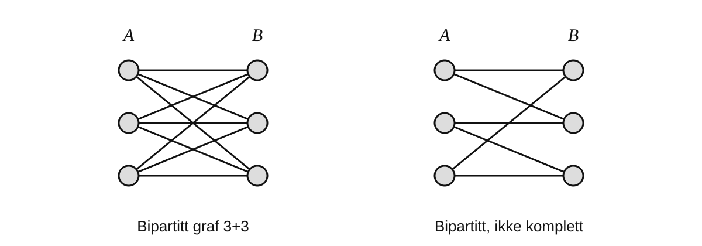{width=100%}
:::

::: {.dark-content}
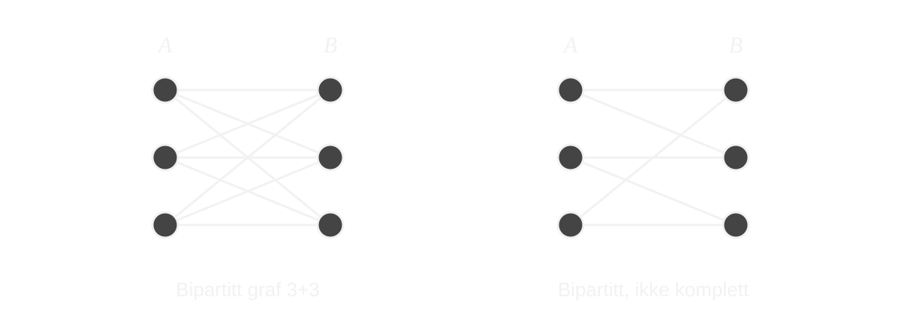{width=100%}
:::
:::

::: {.content-visible when-format="pdf"}
{width=100%}
:::

::: {#exr-bipartitt-sykler name="Hvor lange kan syklene være?"}
Følg en sykel i en bipartitt graf og legg merke til at hjørnene annenhver gang ligger i $A$ og $B$.

1. Forklar hvorfor en sykel må ha partallslengde.
2. Hvorfor kan en bipartitt graf derfor ikke inneholde en trekant?
:::

::: {#exr-plan-ulikheter name="To konsekvenser av Euler"}
La $G$ være en endelig, sammenhengende enkel plan graf med minst tre hjørner.

1. Forklar hvorfor hver flate har minst tre kantforekomster på randen.
2. Dobbelttell kantforekomster langs flater og vis at

$$
3F\leq 2|E|.
$$

3. Bruk Eulers formel til å vise

$$
|E|\leq 3|V|-6.
$$

4. Anta nå at $G$ er bipartitt. Hvorfor har ingen flate rand av lengde tre?
5. Vis i dette tilfellet at

$$
|E|\leq 2|V|-4.
$$
:::

::: {#exr-to-ikkeplane name="To grunnleggende hindringer"}
Bruk @exr-plan-ulikheter til å vise at følgende to grafer ikke er plane:

1. Grafen med fem hjørner der hvert par av forskjellige hjørner er forbundet med en kant.
2. Den bipartitte grafen med tre hjørner i hver del, der alle mulige kanter mellom de to delene er med.

Hvorfor trenger vi to forskjellige ulikheter fra @exr-plan-ulikheter for å avsløre de to grafene?
:::

::: {.content-visible when-format="html"}
::: {.light-content}
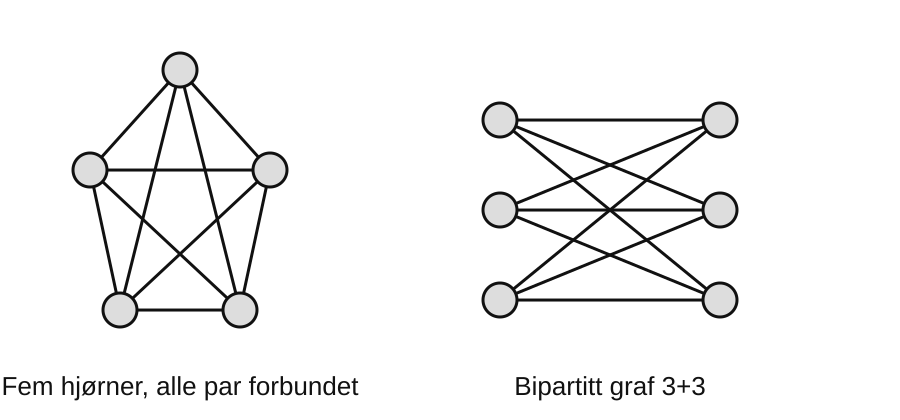{width=100%}
:::

::: {.dark-content}
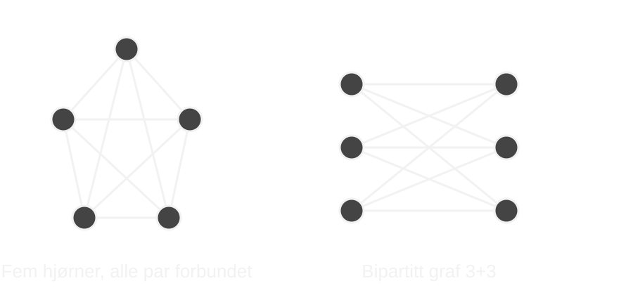{width=100%}
:::
:::

::: {.content-visible when-format="pdf"}
{width=100%}
:::

### Hvorfor dukker subdivisjoner opp?

Å **subdividere** en kant betyr å erstatte den med en sti ved å sette inn nye hjørner av grad $2$.

::: {.content-visible when-format="html"}
::: {.light-content}
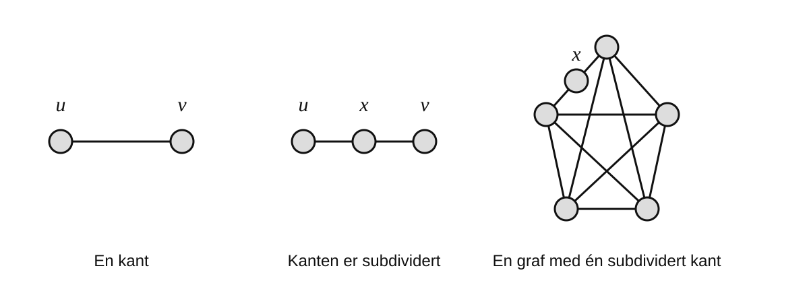{width=100%}
:::

::: {.dark-content}
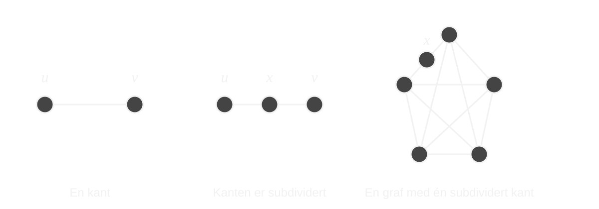{width=100%}
:::
:::

::: {.content-visible when-format="pdf"}
{width=100%}
:::

::: {#exr-subdivisjon-plan name="Subdivisjon endrer ikke planaritet"}
La $G'$ være laget fra $G$ ved å subdividere én kant.

1. Vis at hvis $G$ er plan, så er $G'$ plan.
2. Vis omvendt at hvis $G'$ er plan, så er $G$ plan.
3. Ta nå grafen med fem hjørner der hvert par av forskjellige hjørner er forbundet med en kant. Subdivider én av kantene. Hvorfor er den nye grafen fortsatt ikke plan?
4. Inneholder den nye grafen fortsatt den opprinnelige fem-hjørnersgrafen som en delgraf? Begrunn svaret.
5. Hva viser dette om en planaritetstest som bare leter etter de to grafene i @exr-to-ikkeplane som delgrafer?
:::

::: {#thm-kuratowski name="Kuratowskis teorem"}
En endelig enkel graf er plan hvis og bare hvis den ikke inneholder en delgraf som kan fås ved å
subdividere kanter i en av de to grafene i @exr-to-ikkeplane.
:::

::: {#exr-kuratowski-enkel-retning name="Bevis halvparten av Kuratowski"}
Bruk bare følgende tre fakta:

- de to grafene i @exr-to-ikkeplane er ikke plane,
- subdivisjon bevarer planaritet,
- enhver delgraf av en plan graf er plan.

Bevis den retningen av @thm-kuratowski som følger direkte av disse faktaene.
:::

Den andre retningen er den dype delen av teoremet. Vi skal ikke skjule den bak et langt bevis,
men vi kan undersøke hva et slikt bevis må få til.

::: {#exr-minimal-ikkeplan name="Hva må en minimal ikke-plan graf se ut som?"}
Anta at $G$ er ikke-plan, men at enhver ekte delgraf av $G$ er plan.

Undersøk følgende spørsmål:

1. Kan $G$ ha et isolert hjørne eller et endehjørne?
2. Kan $G$ ha en bro?
3. Kan $G$ ha et artikulasjonspunkt? Forsøk å lime sammen plane tegninger av delene rundt dette hjørnet.
4. Hvis et hjørne har grad $2$, hvorfor er dette akkurat den typen hjørne som kan ha blitt satt inn ved en subdivisjon?
5. La $e=\{u,v\}$ være en kant. Grafen $G-e$ er plan. Hvorfor kan ikke $u$ og $v$ ligge på randen av samme flate i en plan tegning av $G-e$?

Målet er å finne strukturelle begrensninger som et bevis for Kuratowski må utnytte.
:::

::: {#exr-ki-kuratowski name="KI: Hvor gjemmer det vanskelige lemmaet seg?"}
Be en KI om et **kort** bevis for den vanskelige retningen av Kuratowskis teorem.

Les argumentet kritisk og finn det første stedet der KI-en bruker en påstand som ikke er bevist,
eller skriver noe som «man kan vise», «ved en standard argumentasjon» eller tilsvarende.

1. Formuler den skjulte påstanden presist.
2. Er dette bare en liten detalj, eller inneholder den en vesentlig del av teoremet?
3. Sammenlign med det dere allerede har funnet om minimale ikke-plane grafer.

Dette er en øvelse i å skille et bevis fra et bevisomriss.
:::

## Arbeidsøkt 4: Dualitet, polyedre og firefargeproblemet

### Den duale grafen

La $G$ være en sammenhengende plan graf med en bestemt plan innleiring.
Den **duale grafen** $G^*$ konstrueres ved å plassere ett nytt hjørne i hver flate og
la hver kant i $G$ krysses av én tilsvarende kant i $G^*$.

::: {.callout-note title="Figurforslag (SVG)"}
`figures/grafer/dual-graf.svg`: En plan graf og dens dual oppå samme tegning, men visuelt tydelig atskilt.
Figuren skal først og fremst forklare selve dualkonstruksjonen. Vi trenger ikke gjenta kube--oktaeder-dualiteten i denne figuren.
:::

::: {#exr-dual name="Bygg dualen"}
1. Tegn en kube som en plan graf.
2. Plasser ett dualt hjørne i hver av de seks flatene, også den ytre.
3. Tegn de duale kantene.
4. Hvilken kjent polyedergraf får du?
5. Gjør det samme med tetraederet.

Undersøk også hva som kan skje i dualgrafen dersom den opprinnelige grafen har en bro eller
to flater deler mer enn én kant.
:::

### Polyedre som grafer på sfæren

Overflaten til et konvekst polyeder kan deformeres til en sfære.
Hjørner, kanter og flater gir derfor en graf og en celleoppdeling av $S^2$.
Eulers formel blir igjen

$$
|V|-|E|+F=2.
$$

Vi bruker ikke mye tid på klassifikasjonen av regulære polyedre. De er først og fremst gode,
visuelle eksempler på dualitet:

$$
\text{tetraeder}\leftrightarrow\text{tetraeder},
$$

$$
\text{kube}\leftrightarrow\text{oktaeder},
$$

$$
\text{dodekaeder}\leftrightarrow\text{ikosaeder}.
$$

### Fra kartfarging til graf-farging

Tenk igjen på et kart på jordkloden. To regioner skal ha forskjellige farger dersom de deler
en grensestrekning.

::: {.callout-note title="Figurforslag (SVG)"}
`figures/grafer/kart-og-dual.svg`: Et lite kunstig kart med 5--6 regioner og den duale grafen ved siden av.
Bruk ingen faktisk geografi; en ren skjematisk figur er lettere å lese.
:::

::: {#exr-kart-dual name="Gjør kartfarging om til hjørnefarging"}
1. Lag den duale grafen til et lite kart du selv tegner.
2. Forklar hvorfor en fargelegging av regionene er det samme som en hjørnefarging av dualgrafen.
3. Hva svarer to naboland til i dualgrafen?
4. Hvorfor er sfæren og planet ekvivalente for dette spørsmålet?
:::

::: {#thm-firefarge name="Firefargeteoremet"}
Hjørnene i enhver plan graf kan fargelegges med høyst fire farger slik at nabohjørner får
forskjellige farger.
:::

Ved kartfarging er bare grenser mellom to **forskjellige** regioner relevante. Dersom en dualgraf
får en løkke fordi en kant har samme flate på begge sider, ser vi bort fra denne løkken i
fargeleggingsproblemet. Med denne forståelsen er @thm-firefarge det klassiske utsagnet om at
ethvert kart på sfæren eller i planet kan fargelegges med høyst fire farger når regioner som
deler en grensestrekning skal ha ulike farger. Vi skal bruke teoremet, men ikke bevise det.

::: {#exr-firefarge-refleksjon name="Hva binder kapitlet sammen?"}
Lag et kort begrepskart som inneholder minst disse ordene:

**graf**, **sammenheng**, **tre**, **spenntre**, **plan graf**, **sfære**, **flate**,
**Euler**, **Kuratowski**, **dual graf**, **polyeder**, **firefarging**.

Tegn piler mellom begrepene og skriv én kort forklaring på hver pil.

Du kan bruke KI til å foreslå forbindelser, men fjern alle piler du ikke selv kan forklare.
:::

## Etter kapitlet

Du skal særlig kunne:

- bruke de grunnleggende definisjonene for grafer, delgrafer, stier, sykler, sammenheng, trær og skoger,
- forklare og anvende sentrale karakteriseringer av trær,
- forklare hva et spenntre og et minimum spenntre er,
- gjennomføre Kruskals og Prims algoritmer og diskutere deres faktiske kostnad,
- forklare rollen til union--find og forskjellen mellom asymptotisk og praktisk ytelse,
- bruke Eulers formel og forstå hvorfor en plan graf like naturlig kan tegnes på sfæren,
- bruke de to grunnleggende ikke-plane grafene og deres subdivisjoner som hindringer for planaritet,
- forklare innholdet i Kuratowskis teorem og hva som gjør den vanskelige retningen vanskelig,
- konstruere duale grafer og forklare sammenhengen mellom polyedre, kartfarging og firefargeteoremet.
