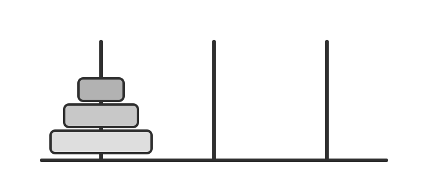
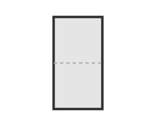
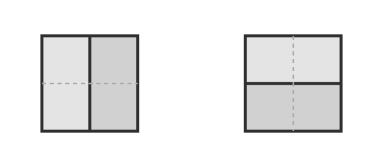
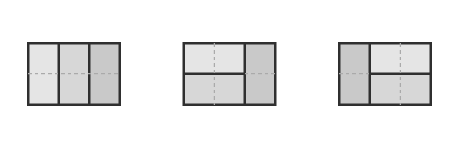
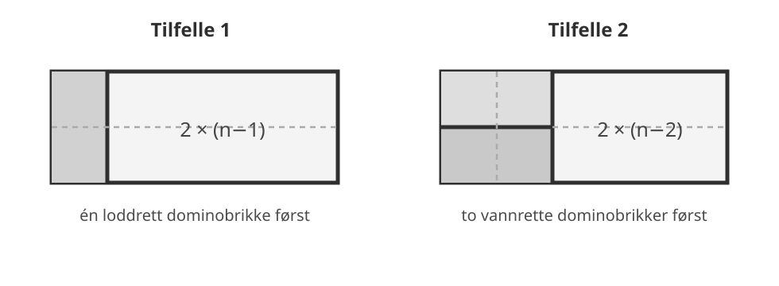

## Arbeidsøkt 1: Rekursjonsformler

I denne arbeidsøkten skal vi undersøke hvordan en følge av tall kan beskrives ved hjelp av tidligere tall i følgen.

Vi skal særlig arbeide med tre spørsmål:

1. Hvordan kan en rekursjonsformel oppstå fra et konkret problem?
2. Hvordan kan vi gå fra en rekursjonsformel til en formel for det $n$-te leddet?
3. Hvordan kan kunstig intelligens brukes til å finne, forklare og kontrollere matematiske argumenter?

::: {.callout-note title="Om KI-oppgavene"}
Når du bruker KI i denne økten, er målet ikke bare å få et svar.

1. Forsøk først selv å forstå problemet eller formulere hva du står fast på.
2. Bruk KI til et tydelig avgrenset formål: et hint, et bevis, en forklaring eller kontroll av en beregning.
3. Kontroller minst ett viktig steg selv.
4. Avgjør til slutt selv om KI-svaret er matematisk holdbart.

En overbevisende formulering fra en KI er ikke i seg selv en matematisk begrunnelse.
:::

### Hanoi-tårnene

Vi har tre stolper og $n$ sirkelformede skiver med forskjellig størrelse. I starten ligger alle skivene på den første stolpen, med den største nederst og den minste øverst.

{width=65%}

Vi vil flytte hele tårnet til en annen stolpe.

Reglene er:

- Vi kan bare flytte én skive om gangen.
- Vi kan aldri legge en større skive oppå en mindre skive.

La $a_n$ være det minste antallet flytt som er nødvendig når vi har $n$ skiver.

::: {#exr-hanoi-smaa name="Hanoi med få skiver"}
Finn $a_1$, $a_2$ og $a_3$.

Prøv gjerne å utføre flyttene med mynter, papirbiter eller andre objekter.

Kan du også finne $a_4$ uten å liste opp alle flyttene?
:::

For å flytte et tårn med $n$ skiver må den største skiven på et tidspunkt flyttes.

Før det kan skje må alle de $n-1$ mindre skivene flyttes bort fra den. Etter at den største skiven er flyttet, må de $n-1$ mindre skivene flyttes oppå den igjen.

::: {#exr-hanoi-rekurrens name="Finn rekursjonsformelen"}
Bruk observasjonen over til å forklare hvorfor

$$
a_n=2a_{n-1}+1.
$$

Hvilken startverdi må vi oppgi sammen med denne ligningen?

Sammenlign forklaringen din med forklaringen til noen som sitter i nærheten.
:::

#### Rekursjonsformler

En **rekursjonsformel** (også kalt en **rekurrensrelasjon**) beskriver ledd i en følge ved hjelp av tidligere ledd.

Ligningen

$$
a_n=2a_{n-1}+1
$$

er en rekursjonsformel.

For at den skal bestemme følgen, trenger vi også en **initialbetingelse**. For Hanoi-problemet er denne

$$
a_1=1.
$$

Rekursjonsformelen og initialbetingelsen bestemmer sammen hele følgen. En følge som er gitt på denne måten, kalles **rekursivt definert**.

::: {#exr-hanoi-verdier name="Fra rekursjonsformel til tall"}
Bruk

$$
a_1=1,\qquad a_n=2a_{n-1}+1
$$

til å beregne $a_2,a_3,a_4,a_5$ og $a_6$.

Se etter et mønster og gjett en formel for $a_n$ som ikke bruker tidligere ledd i følgen.
:::

En formel som gir $a_n$ direkte fra $n$, uten først å beregne $a_1,\ldots,a_{n-1}$, kaller vi her en **eksplisitt formel**.

::: {#exr-ki-hanoi-bevis name="KI: Kan hypotesen bevises?"}
Du har nå en hypotese om en eksplisitt formel for $a_n$.

**Bruk kunstig intelligens.**

Be KI om å bevise hypotesen ved induksjon.

Les beviset den gir deg, og kontroller spesielt:

1. Hvilket utsagn er det som bevises ved induksjon?
2. Kontrolleres startverdien?
3. Hvor brukes rekursjonsformelen?
4. Hvor brukes induksjonshypotesen?

Hvis KI bruker en annen nummerering av følgen enn vi gjør, må du avgjøre om argumentet likevel er riktig.

Skriv til slutt med én eller to setninger hvorfor du mener beviset holder, eller hva som må rettes.
:::

### Et nytt telleproblem

Vi skal nå dekke et rektangel som er $2$ ruter høyt og $n$ ruter langt med dominobrikker.

Hver dominobrikke dekker to ruter som ligger ved siden av hverandre. Den kan altså ligge enten loddrett eller vannrett.

La $p_n$ være antallet forskjellige måter et $2\times n$-rektangel kan dekkes fullstendig på.

::: {#exr-flislegging-smaa name="Tegn de første tilfellene"}
Tegn alle mulige dekninger når

$$
n=1,\qquad n=2,\qquad n=3.
$$

Finn dermed $p_1,p_2$ og $p_3$.

Prøv også å finne $p_4$.
:::

:::: {.callout-tip collapse="true" title="Kontroller tegningene dine"}
::: {layout-ncol=3}

:::
::::

Nå skal vi prøve å telle uten å tegne alle mulighetene.

Se på den **venstre kanten** av et ferdig dekket $2\times n$-rektangel.

Det finnes to muligheter:

- Den venstre kolonnen er dekket av én loddrett dominobrikke.
- De to rutene lengst til venstre tilhører to vannrette dominobrikker.

{width=90%}

::: {#exr-flislegging-rekurrens name="Del problemet i to tilfeller"}
Forklar hvorfor de to tilfellene over gir rekursjonsformelen

$$
p_n=p_{n-1}+p_{n-2}.
$$

Hvorfor har vi fått med alle mulige dekninger?

Hvorfor blir ingen dekning telt to ganger?
:::

Vi kjenner igjen tallene

$$
1,2,3,5,8,13,\ldots
$$

Dette er Fibonacci-følgen med nummereringen

$$
F_1=1,\qquad F_2=2,\qquad
F_n=F_{n-1}+F_{n-2}\quad(n\geq3).
$$

::: {#exr-ki-fibonacci-kritikk name="KI: Et argument som ikke er godt nok"}
Tenk deg at noen sier:

> Vi fant $p_1=1,p_2=2,p_3=3,p_4=5$. Derfor er $p_n$ Fibonacci-følgen.

Be en KI vurdere dette argumentet.

Diskuter deretter:

1. Hvorfor er det ikke nok å kontrollere de første fire verdiene?
2. Hva er det i argumentet med dominobrikkene som faktisk viser at følgene fortsetter å være like?
3. Hvis KI hevder noe du ikke er enig i, avgjør selv hvem som har rett.
:::

### Hvordan finner vi en eksplisitt formel?

Vi har nå sett rekursjonsformelen

$$
F_n=F_{n-1}+F_{n-2}.
$$

Den lar oss lett beregne neste Fibonacci-tall når vi kjenner de to foregående. Men den gir ikke $F_{100}$ direkte.

Vi skal derfor undersøke rekursjonsformler av formen

$$
a_n=Aa_{n-1}+Ba_{n-2},
\qquad n\geq3,
$$

der $A$ og $B$ er faste tall og $a_1,a_2$ er gitt.

Dette kalles en **lineær rekursjonsformel av andre orden med konstante koeffisienter**.

#### Prøv en enkel type løsning

Anta at en løsning har formen

$$
a_n=r^n.
$$

Setter vi dette inn i rekursjonsformelen, får vi

$$
r^n=Ar^{n-1}+Br^{n-2}.
$$

Dersom $r\neq0$, kan vi dele på $r^{n-2}$.

::: {#exr-karakteristisk-ligning name="Finn ligningen for r"}
Gjennomfør divisjonen og vis at $r$ må oppfylle

$$
r^2-Ar-B=0.
$$

Denne ligningen kaller vi den **karakteristiske ligningen** til rekursjonsformelen.

Be gjerne KI kontrollere utregningen din dersom du er usikker.
:::

Hvis $r$ er en rot i den karakteristiske ligningen, vil altså følgen

$$
a_n=r^n
$$

oppfylle rekursjonsformelen.

Har den karakteristiske ligningen to forskjellige røtter $\alpha$ og $\beta$, får vi derfor to løsninger

$$
\alpha^n
\qquad\text{og}\qquad
\beta^n.
$$

Dessuten er enhver lineærkombinasjon

$$
C\alpha^n+D\beta^n
$$

også en løsning.

::: {#exr-ki-lineaerkombinasjon name="KI: Hvorfor kan løsningene kombineres?"}
Be KI forklare hvorfor

$$
a_n=C\alpha^n+D\beta^n
$$

oppfyller rekursjonsformelen når både $\alpha^n$ og $\beta^n$ gjør det.

Be om en kort algebraisk forklaring.

Kontroller selv forklaringen ved å sette uttrykket inn i

$$
a_n=Aa_{n-1}+Ba_{n-2}.
$$

Hva er det ved rekursjonsformelen som gjør at lineærkombinasjoner fungerer?
:::

::: {#thm-lineaer-rekurrens name="Lineære rekursjonsformler av andre orden"}
Anta at

$$
a_n=Aa_{n-1}+Ba_{n-2},
$$

der $a_1$ og $a_2$ er gitt.

La $\alpha$ og $\beta$ være røttene i den karakteristiske ligningen

$$
r^2-Ar-B=0.
$$

Hvis $\alpha\neq\beta$, finnes konstanter $C$ og $D$ slik at

$$
a_n=C\alpha^n+D\beta^n.
$$

Hvis den karakteristiske ligningen har en dobbeltrot $\alpha$, finnes konstanter $C$ og $D$ slik at

$$
a_n=(C+Dn)\alpha^n.
$$

Konstantene bestemmes av initialbetingelsene.
:::

::: {#exr-ki-teorem-bevis name="KI: Undersøk teoremet"}
Bruk KI til å få et bevis eller en begrunnelse for teoremet.

Du trenger ikke skrive av hele beviset.

Finn i stedet svar på disse spørsmålene:

1. Hvorfor oppfyller $\alpha^n$ og $\beta^n$ rekursjonsformelen når røttene er forskjellige?
2. Hvorfor oppfyller også lineærkombinasjonen rekursjonsformelen?
3. Hvordan brukes $a_1$ og $a_2$ til å bestemme $C$ og $D$?
4. I tilfellet med dobbeltrot: kontroller ved innsetting at $n\alpha^n$ også er en løsning.

Hvis KI hopper over den siste kontrollen, be den vise akkurat denne utregningen.
:::

### Tilbake til Fibonacci-følgen

For

$$
F_n=F_{n-1}+F_{n-2}
$$

er den karakteristiske ligningen

$$
r^2-r-1=0.
$$

::: {#exr-fibonacci-eksplisitt name="Finn en eksplisitt formel"}
1. Finn røttene i
   $$
   r^2-r-1=0.
   $$

2. Skriv den generelle løsningen på formen
   $$
   F_n=C\alpha^n+D\beta^n.
   $$

3. Bruk
   $$
   F_1=1,\qquad F_2=2
   $$
   til å bestemme $C$ og $D$.

**Bruk gjerne KI til algebraen i punkt 3.**

Men før du godtar svaret:

- kontroller at formelen gir $F_1=1$ og $F_2=2$;
- bruk formelen til å beregne $F_3$;
- kontroller at du får $F_3=3$.
:::

Den positive roten

$$
\frac{1+\sqrt5}{2}
$$

kalles **det gylne snitt**.

Den andre roten har tallverdi mindre enn $1$.

::: {#exr-fibonacci-vekst name="Hva skjer når n blir stor?"}
Bruk den eksplisitte formelen du nettopp fant.

Hva tror du skjer med forholdet

$$
\frac{F_{n+1}}{F_n}
$$

når $n$ blir stor?

Be KI forklare hvorfor, men prøv først selv å formulere en forklaring ut fra de to røttene i den karakteristiske ligningen.
:::

### Dobbeltrot

Betrakt rekursjonsformelen

$$
a_n=4a_{n-1}-4a_{n-2},
\qquad
a_1=1,\quad a_2=3.
$$

::: {#exr-dobbeltrot name="En rekursjonsformel med dobbeltrot"}
1. Finn den karakteristiske ligningen.
2. Vis at den har en dobbeltrot.
3. Bruk teoremet til å skrive
   $$
   a_n=(C+Dn)\alpha^n.
   $$
4. Bestem $C$ og $D$ fra initialbetingelsene.

Du kan bruke KI til å kontrollere utregningene.

Når du har fått en eksplisitt formel, kontroller den ved å:

- beregne $a_1$ og $a_2$;
- beregne $a_3$ både fra rekursjonsformelen og fra den eksplisitte formelen.
:::

### Oppsummering av arbeidsøkt 1

Etter denne arbeidsøkten bør du kunne gå begge veier i diagrammet

$$
\boxed{
\text{problem}
\longrightarrow
\text{rekursjonsformel og initialbetingelser}
\longrightarrow
\text{eksplisitt formel}
}
$$

For en lineær rekursjonsformel av andre orden

$$
a_n=Aa_{n-1}+Ba_{n-2}
$$

er det sentrale verktøyet den karakteristiske ligningen

$$
r^2-Ar-B=0.
$$

Når du bruker KI i matematikk, er det ikke nok at svaret ser overbevisende ut. I denne økten har du blant annet brukt tre måter å kontrollere KI på:

- sette et foreslått uttrykk inn i en rekursjonsformel;
- kontrollere initialbetingelser;
- undersøke hvert steg i et bevis eller argument.

---

## Arbeidsøkt 2: Genererende funksjoner, derangements og Catalan-tall

I den første arbeidsøkten brukte vi rekursjonsformler til å beskrive følger og den karakteristiske ligningen til å finne eksplisitte formler. I denne økten skal vi møte et nytt verktøy: **genererende funksjoner**.

Vi skal bruke dem til å:

1. pakke en hel følge inn i én potensrekke,
2. finne eksplisitte formler på en ny måte,
3. forstå hvorfor produkter av potensrekker gir summer av produkter av koeffisienter,
4. arbeide med derangements og Catalan-tall.

::: {.callout-note title="KI i denne arbeidsøkten"}
Bruk KI til å fylle inn detaljer som ellers ville tatt mye plass i teksten: algebra, delbrøkoppspalting, bevis og koeffisientutregninger.

Men gjør alltid minst én matematisk kontroll selv. Det kan være å sette et uttrykk inn i en rekursjonsformel, regne ut de første leddene eller kontrollere en koeffisient direkte.
:::

### Genererende funksjoner

La

$$
a_0,a_1,a_2,\ldots
$$

være en følge. Den **genererende funksjonen** til følgen er potensrekken

$$
A(x)=a_0+a_1x+a_2x^2+\cdots=\sum_{n=0}^{\infty}a_nx^n.
$$

I denne sammenhengen tenker vi først og fremst **formelt**: koeffisienten foran $x^n$ lagrer tallet $a_n$. Vi trenger ikke begynne med spørsmål om konvergens.

::: {#exr-les-genererende-funksjon name="Les av en følge"}
Hvilke følger har disse genererende funksjonene?

1. $1+x+x^2+x^3+\cdots$
2. $1+2x+4x^2+8x^3+\cdots$
3. $1-x+x^2-x^3+\cdots$

Skriv de fem første leddene i hver følge.
:::

#### Den geometriske rekken

Vi har den grunnleggende identiteten

$$
1+x+x^2+x^3+\cdots=\frac{1}{1-x}.
$$

Erstatter vi $x$ med $ax$, får vi

$$
1+ax+a^2x^2+a^3x^3+\cdots=\frac{1}{1-ax}.
$$

::: {#exr-ki-geometrisk name="KI: Hvorfor virker den geometriske rekken?"}
Be KI gi en **kort formell kontroll** av

$$
(1-x)(1+x+x^2+x^3+\cdots)=1.
$$

Finn selv hvor kansellasjonene skjer. Forklar deretter med egne ord hvorfor dette ikke krever at vi setter inn en bestemt tallverdi for $x$.
:::

#### Produkt av genererende funksjoner

La

$$
A(x)=\sum_{n=0}^{\infty}a_nx^n,
\qquad
B(x)=\sum_{n=0}^{\infty}b_nx^n.
$$

Hvis

$$
A(x)B(x)=\sum_{n=0}^{\infty}c_nx^n,
$$

så er koeffisienten til $x^n$

$$
c_n=a_0b_n+a_1b_{n-1}+\cdots+a_nb_0
=\sum_{j=0}^{n}a_jb_{n-j}.
$$

Dette kalles ofte **Cauchy-produktet** av de to rekkene.

::: {#exr-cauchy-produkt name="Koeffisienten i et produkt"}
Sett

$$
A(x)=B(x)=1+x+x^2+x^3+\cdots.
$$

1. Finn koeffisienten til $x^0,x^1,x^2,x^3$ og $x^4$ i $A(x)B(x)$.
2. Gjett koeffisienten til $x^n$.
3. Bruk $A(x)=B(x)=1/(1-x)$ til å skrive resultatet som en formel for $1/(1-x)^2$.
:::

#### En liten verktøykasse

Ved å derivere den geometriske rekken flere ganger får vi følgende nyttige familie av formler.

::: {#thm-genererende-standardformel name="En standardformel for genererende funksjoner"}
For $k\geq0$ gjelder

$$
\frac{1}{(1-x)^{k+1}}
=
\sum_{n=0}^{\infty}\binom{n+k}{k}x^n.
$$

Mer generelt,

$$
\frac{1}{(1-ax)^{k+1}}
=
\sum_{n=0}^{\infty}\binom{n+k}{k}a^n x^n.
$$
:::

::: {#exr-ki-standardformel name="KI: Generer utledningen"}
Be KI vise hvordan formelen for $1/(1-x)^{k+1}$ kan bygges opp ved å derivere

$$
\frac{1}{1-x}=1+x+x^2+\cdots.
$$

Du trenger ikke skrive av hele utledningen. Kontroller i stedet selv tilfellene $k=0$, $k=1$ og $k=2$.

Finn deretter koeffisienten til $x^6$ i

$$
\frac{1}{(1-2x)^3}.
$$
:::

### Fibonacci på nytt – nå med en genererende funksjon

Vi bruker samme nummerering som i første arbeidsøkt:

$$
F_1=1,\qquad F_2=2,\qquad F_n=F_{n-1}+F_{n-2}\quad(n\geq3).
$$

Sett

$$
F(x)=F_1x+F_2x^2+F_3x^3+\cdots.
$$

::: {#exr-fibonacci-genererende name="Fra rekursjonsformel til funksjon"}
Bruk rekursjonsformelen til å vise at

$$
F(x)-x-2x^2=xF(x)-x^2+x^2F(x).
$$

Samle alle ledd med $F(x)$ på én side og vis at

$$
F(x)=\frac{x+x^2}{1-x-x^2}.
$$

Be deretter KI om å faktorisere nevneren og gjøre en delbrøkoppspalting. Les av koeffisienten til $x^n$ og sammenlign den eksplisitte formelen med den dere fant i første arbeidsøkt.

**Kontroll:** Regn ut koeffisientene til $x$, $x^2$ og $x^3$ direkte fra svaret og sjekk at de er $1,2,3$.
:::

::: {.callout-note title="Pause – 15 minutter"}
Ta pause før du går videre til derangements og Catalan-tall.
:::

### Derangements

Tenk deg at $n$ personer leverer hver sin jakke i en garderobe. Etterpå får hver person tilfeldig én av jakkene tilbake.

Et **derangement** av $1,2,\ldots,n$ er en permutasjon der ingen står på sin opprinnelige plass.

La $d_n$ være antallet derangements av $n$ objekter. De første verdiene er

$$
d_1=0,\qquad d_2=1,\qquad d_3=2,\qquad d_4=9.
$$

::: {#exr-derangement-smaa name="Kontroller små tilfeller"}
Skriv opp de to derangementene av $1,2,3$.

Velg deretter ett av de ni derangementene av fire objekter ved hjelp av KI. Kontroller selv at ingen av tallene $1,2,3,4$ står på sin egen plass.
:::

For $n\geq3$ gjelder rekursjonsformelen

$$
d_n=(n-1)(d_{n-1}+d_{n-2}).
$$

::: {#exr-ki-derangement-rekurrens name="KI: Finn de to tilfellene"}
Be KI forklare rekursjonsformelen ved å se på hva som skjer med objekt nummer $n$.

Be den dele argumentet i nøyaktig to tilfeller:

1. $n$ bytter plass med et annet objekt.
2. $n$ bytter ikke plass direkte med objektet som havner på plass $n$.

Kontroller selv at det første tilfellet gir $(n-1)d_{n-2}$ og at det andre gir $(n-1)d_{n-1}$.

Bruk deretter rekursjonsformelen til å beregne $d_5$ og $d_6$.
:::

Ved å omskrive rekursjonsformelen kan man få

$$
d_n-nd_{n-1}=(-1)^n.
$$

Dividerer vi med $n!$ og summerer, oppstår en teleskopsum. Resultatet er:

::: {#thm-derangements-formel name="Formelen for antall derangements"}
For $n\geq1$ er

$$
d_n=n!\sum_{m=0}^{n}\frac{(-1)^m}{m!}.
$$
:::

::: {#exr-ki-derangement-formel name="KI: Fyll inn teleskoperingsdetaljene"}
Be KI starte med

$$
\frac{d_n}{n!}-\frac{d_{n-1}}{(n-1)!}=\frac{(-1)^n}{n!}
$$

og vise hvordan summering fra $2$ til $n$ gir formelen over.

Du skal selv kontrollere én av kansellasjonene i teleskopsummen og at formelen gir $d_4=9$.

Til slutt: sammenlign

$$
\frac{d_6}{6!}
$$

med $1/e$. Hva forteller dette om sannsynligheten for at ingen får sin egen jakke når $n$ blir stor?
:::

### Catalan-tall

Vi ser nå på stier i et kvadratisk rutenett. En sti går fra $A=(0,0)$ til $B=(n,n)$ og hvert skritt går enten **én rute mot høyre** eller **én rute opp**.

Vi teller bare stier som aldri går over diagonalen fra $A$ til $B$.

{width=55%}

La $p_n$ være antallet slike stier, og sett $p_0=1$.

::: {#exr-catalan-smaa name="Finn de første Catalan-tallene"}
Bruk figuren til å tegne alle gode stier når $n=3$.

Kontroller også $n=1$ og $n=2$.

Du skal finne

$$
p_0=1,\qquad p_1=1,\qquad p_2=2,\qquad p_3=5.
$$
:::

For en god sti fra $A$ til $B$, se på **siste gang stien møter diagonalen før den kommer til $B$**. Anta at dette skjer i punktet $C=(m,m)$.

{width=80%}

Før $C$ har vi et godt ruteproblem av størrelse $m$. Etter $C$ må stien først gå mot høyre, og den gjenværende delen svarer til et godt ruteproblem av størrelse $n-m-1$.

::: {#exr-catalan-rekurrens name="Forklar rekursjonsformelen"}
Bruk figuren, multiplikasjonsprinsippet og addisjonsprinsippet til å forklare rekursjonsformelen

$$
p_n=\sum_{m=0}^{n-1}p_mp_{n-m-1}.
$$

Hvis du står fast, be KI forklare hvilken rolle «siste møte med diagonalen» spiller. Avgjør deretter selv hvorfor forskjellige verdier av $m$ gir adskilte tilfeller.
:::

#### Genererende funksjon for Catalan-tallene

Sett

$$
C(x)=p_0+p_1x+p_2x^2+\cdots.
$$

Nå blir produktregelen for genererende funksjoner avgjørende.

::: {#exr-catalan-genererende name="Fra rekursjonsformel til en ligning"}
Bruk rekursjonsformelen for Catalan-tallene og Cauchy-produktet til å vise at

$$
C(x)^2=\sum_{n=0}^{\infty}p_{n+1}x^n.
$$

Vis deretter at

$$
xC(x)^2=C(x)-1,
$$

altså

$$
xC(x)^2-C(x)+1=0.
$$

Løs den kvadratiske ligningen med hensyn på $C(x)$. Det finnes to algebraiske løsninger. Hvilken av dem kan være en potensrekke med konstantledd $p_0=1$?
:::

Vi får

$$
C(x)=\frac{1-\sqrt{1-4x}}{2x}.
$$

Når kvadratroten utvikles som en potensrekke, kan koeffisientene leses av. Resultatet er:

::: {#thm-catalan-formel name="Catalan-tallene"}
Catalan-tallene er

$$
C_n=\frac{1}{n+1}\binom{2n}{n},\qquad n\geq0.
$$

De begynner

$$
1,1,2,5,14,42,\ldots.
$$
:::

::: {#exr-ki-catalan-koeffisient name="KI: Fra kvadratrot til koeffisient"}
Be KI forklare hvordan man går fra

$$
\frac{1-\sqrt{1-4x}}{2x}
$$

til

$$
C_n=\frac{1}{n+1}\binom{2n}{n}.
$$

Du trenger ikke gjengi alle algebraiske detaljer. Kontroller i stedet formelen for $n=0,1,2,3,4$, og kontroller at disse tallene oppfyller rekursjonsformelen for $n=4$.
:::

#### Samme tall i et nytt problem

Catalan-tallene dukker opp i mange forskjellige telleproblemer. Blant annet er

$$
C_{n-2}
$$

antallet måter en konveks $n$-kant kan deles i trekanter ved hjelp av ikke-kryssende diagonaler.

For en femkant får vi $C_3=5$:

{width=95%}

::: {#exr-catalan-femkant name="To beskrivelser av tallet 5"}
Sammenlign de fem gode stiene i et $3\times3$-rutenett med de fem trianguleringene av en femkant.

Be KI forklare hvorfor begge problemene teller Catalan-tallet $C_3$. Be den være tydelig på at dette **ikke** betyr at de fem objektene i de to problemene allerede er gitt i en åpenbar én-til-én-korrespondanse.

Hva er det vi faktisk vet på dette tidspunktet?
:::

### Oppsummering av arbeidsøkt 2

I denne arbeidsøkten har vi brukt genererende funksjoner som et algebraisk språk for følger:

$$
(a_0,a_1,a_2,\ldots)
\longleftrightarrow
A(x)=\sum_{n\geq0}a_nx^n.
$$

Tre ideer er spesielt viktige:

1. Rekursjonsformler kan bli algebraiske ligninger for genererende funksjoner.
2. Produktet av to genererende funksjoner gir konvolusjonssummer av koeffisientene.
3. Den samme følgen kan oppstå i svært forskjellige telleproblemer.

Denne uken har vi dermed gått fra konkrete telleproblemer til rekursjonsformler, fra rekursjonsformler til eksplisitte formler, og videre til genererende funksjoner som et nytt verktøy for å organisere og løse problemene.
