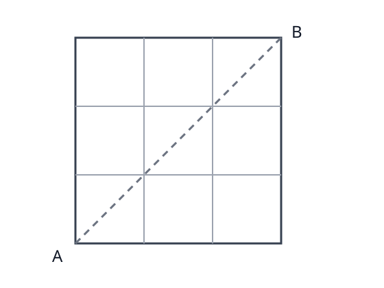
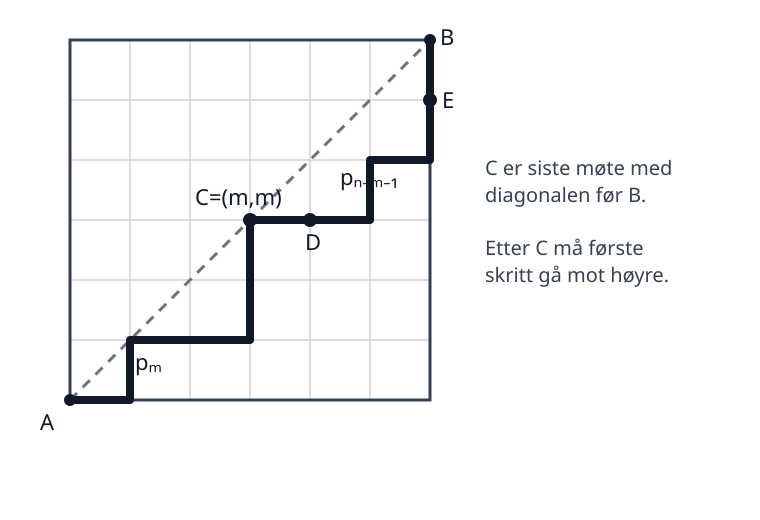
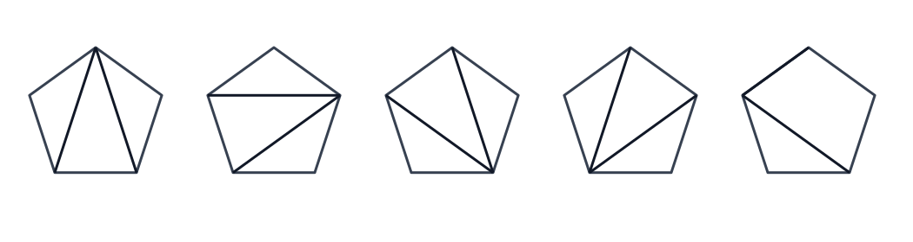

# Genererende funksjoner, derangements og Catalan-tall

I den første arbeidsøkten brukte vi rekurrenser til å beskrive følger og den karakteristiske ligningen til å finne eksplisitte formler. I denne økten skal vi møte et nytt verktøy: **genererende funksjoner**.

Vi skal bruke dem til å:

1. pakke en hel følge inn i én potensrekke,
2. løse en rekurrens på en ny måte,
3. forstå hvorfor produkter av potensrekker gir summer av produkter av koeffisienter,
4. arbeide med derangements og Catalan-tall.

::: {.callout-note title="KI i denne arbeidsøkten"}
Bruk KI til å fylle inn detaljer som ellers ville tatt mye plass i teksten: algebra, delbrøkoppspalting, bevis og koeffisientutregninger.

Men gjør alltid minst én matematisk kontroll selv. Det kan være å sette et uttrykk inn i en rekurrens, regne ut de første leddene eller kontrollere en koeffisient direkte.
:::

## En kort bro fra forrige økt: ikke-homogene rekurrenser

En rekurrens på formen

$$
a_n=Aa_{n-1}+Ba_{n-2}
$$

kalles **homogen**. Hvis vi i stedet har

$$
a_n=Aa_{n-1}+Ba_{n-2}+t_n,
$$

der $t_n$ er en gitt følge, kalles rekurrensen **ikke-homogen**.

En viktig idé er:

> Finn først den generelle løsningen av den homogene rekurrensen. Finn deretter én bestemt løsning av den ikke-homogene rekurrensen. Summen av disse gir den generelle løsningen av den ikke-homogene rekurrensen.

::: {#exr-ikkehomogen-ki name="KI: En ikke-homogen rekurrens"}
Betrakt

$$
a_n=-a_{n-1}+3\cdot2^{n-1},\qquad a_1=0.
$$

1. Vis selv at $a_n=2^n$ er én bestemt løsning.
2. Finn løsningen av den homogene rekurrensen $a_n=-a_{n-1}$.
3. Be KI sette de to delene sammen og bruke initialbetingelsen.
4. Kontroller svaret ved å beregne $a_2$ og $a_3$ både fra rekurrensen og fra den eksplisitte formelen.
:::

## Genererende funksjoner

La

$$
a_0,a_1,a_2,\ldots
$$

være en følge. Den **genererende funksjonen** til følgen er potensrekken

$$
A(x)=a_0+a_1x+a_2x^2+\cdots=\sum_{n=0}^{\infty}a_nx^n.
$$

I denne sammenhengen tenker vi først og fremst **formelt**: koeffisienten foran $x^n$ lagrer tallet $a_n$. Vi trenger ikke begynne med spørsmål om konvergens.

::: {#exr-les-genererende-funksjon name="Les av en følge"}
Hvilke følger har disse genererende funksjonene?

1. $1+x+x^2+x^3+\cdots$
2. $1+2x+4x^2+8x^3+\cdots$
3. $1-x+x^2-x^3+\cdots$

Skriv de fem første leddene i hver følge.
:::

### Den geometriske rekken

Vi har den grunnleggende identiteten

$$
1+x+x^2+x^3+\cdots=\frac{1}{1-x}.
$$

Erstatter vi $x$ med $ax$, får vi

$$
1+ax+a^2x^2+a^3x^3+\cdots=\frac{1}{1-ax}.
$$

::: {#exr-ki-geometrisk name="KI: Hvorfor virker den geometriske rekken?"}
Be KI gi en **kort formell kontroll** av

$$
(1-x)(1+x+x^2+x^3+\cdots)=1.
$$

Finn selv hvor kansellasjonene skjer. Forklar deretter med egne ord hvorfor dette ikke krever at vi setter inn en bestemt tallverdi for $x$.
:::

### Produkt av genererende funksjoner

La

$$
A(x)=\sum_{n=0}^{\infty}a_nx^n,
\qquad
B(x)=\sum_{n=0}^{\infty}b_nx^n.
$$

Hvis

$$
A(x)B(x)=\sum_{n=0}^{\infty}c_nx^n,
$$

så er koeffisienten til $x^n$

$$
c_n=a_0b_n+a_1b_{n-1}+\cdots+a_nb_0
=\sum_{j=0}^{n}a_jb_{n-j}.
$$

Dette kalles ofte **Cauchy-produktet** av de to rekkene.

::: {#exr-cauchy-produkt name="Koeffisienten i et produkt"}
Sett

$$
A(x)=B(x)=1+x+x^2+x^3+\cdots.
$$

1. Finn koeffisienten til $x^0,x^1,x^2,x^3$ og $x^4$ i $A(x)B(x)$.
2. Gjett koeffisienten til $x^n$.
3. Bruk $A(x)=B(x)=1/(1-x)$ til å skrive resultatet som en formel for $1/(1-x)^2$.
:::

### En liten verktøykasse

Ved å derivere den geometriske rekken flere ganger får vi følgende nyttige familie av formler.

::: {#thm-genererende-standardformel name="En standardformel for genererende funksjoner"}
For $k\geq0$ gjelder

$$
\frac{1}{(1-x)^{k+1}}
=
\sum_{n=0}^{\infty}\binom{n+k}{k}x^n.
$$

Mer generelt,

$$
\frac{1}{(1-ax)^{k+1}}
=
\sum_{n=0}^{\infty}\binom{n+k}{k}a^n x^n.
$$
:::

::: {#exr-ki-standardformel name="KI: Generer utledningen"}
Be KI vise hvordan formelen for $1/(1-x)^{k+1}$ kan bygges opp ved å derivere

$$
\frac{1}{1-x}=1+x+x^2+\cdots.
$$

Du trenger ikke skrive av hele utledningen. Kontroller i stedet selv tilfellene $k=0$, $k=1$ og $k=2$.

Finn deretter koeffisienten til $x^6$ i

$$
\frac{1}{(1-2x)^3}.
$$
:::

## Fibonacci på nytt – nå med en genererende funksjon

Vi bruker samme nummerering som i første arbeidsøkt:

$$
F_1=1,\qquad F_2=2,\qquad F_n=F_{n-1}+F_{n-2}\quad(n\geq3).
$$

Sett

$$
F(x)=F_1x+F_2x^2+F_3x^3+\cdots.
$$

::: {#exr-fibonacci-genererende name="Fra rekurrens til funksjon"}
Bruk rekurrensen til å vise at

$$
F(x)-x-2x^2=xF(x)-x^2+x^2F(x).
$$

Samle alle ledd med $F(x)$ på én side og vis at

$$
F(x)=\frac{x+x^2}{1-x-x^2}.
$$

Be deretter KI om å faktorisere nevneren og gjøre en delbrøkoppspalting. Les av koeffisienten til $x^n$ og sammenlign den eksplisitte formelen med den dere fant i første arbeidsøkt.

**Kontroll:** Regn ut koeffisientene til $x$, $x^2$ og $x^3$ direkte fra svaret og sjekk at de er $1,2,3$.
:::

# Pause

## Derangements

Tenk deg at $n$ personer leverer hver sin jakke i en garderobe. Etterpå får hver person tilfeldig én av jakkene tilbake.

Et **derangement** av $1,2,\ldots,n$ er en permutasjon der ingen står på sin opprinnelige plass.

La $d_n$ være antallet derangements av $n$ objekter. De første verdiene er

$$
d_1=0,\qquad d_2=1,\qquad d_3=2,\qquad d_4=9.
$$

::: {#exr-derangement-smaa name="Kontroller små tilfeller"}
Skriv opp de to derangementene av $1,2,3$.

Velg deretter ett av de ni derangementene av fire objekter ved hjelp av KI. Kontroller selv at ingen av tallene $1,2,3,4$ står på sin egen plass.
:::

For $n\geq3$ gjelder rekurrensen

$$
d_n=(n-1)(d_{n-1}+d_{n-2}).
$$

::: {#exr-ki-derangement-rekurrens name="KI: Finn de to tilfellene"}
Be KI forklare rekurrensen ved å se på hva som skjer med objekt nummer $n$.

Be den dele argumentet i nøyaktig to tilfeller:

1. $n$ bytter plass med et annet objekt.
2. $n$ bytter ikke plass direkte med objektet som havner på plass $n$.

Kontroller selv at det første tilfellet gir $(n-1)d_{n-2}$ og at det andre gir $(n-1)d_{n-1}$.

Bruk deretter rekurrensen til å beregne $d_5$ og $d_6$.
:::

Ved å omskrive rekurrensen kan man få

$$
d_n-nd_{n-1}=(-1)^n.
$$

Dividerer vi med $n!$ og summerer, oppstår en teleskopsum. Resultatet er:

::: {#thm-derangements-formel name="Formelen for antall derangements"}
For $n\geq1$ er

$$
d_n=n!\sum_{m=0}^{n}\frac{(-1)^m}{m!}.
$$
:::

::: {#exr-ki-derangement-formel name="KI: Fyll inn teleskoperingsdetaljene"}
Be KI starte med

$$
\frac{d_n}{n!}-\frac{d_{n-1}}{(n-1)!}=\frac{(-1)^n}{n!}
$$

og vise hvordan summering fra $2$ til $n$ gir formelen over.

Du skal selv kontrollere én av kansellasjonene i teleskopsummen og at formelen gir $d_4=9$.

Til slutt: sammenlign

$$
\frac{d_6}{6!}
$$

med $1/e$. Hva forteller dette om sannsynligheten for at ingen får sin egen jakke når $n$ blir stor?
:::

## Catalan-tall

Vi ser nå på stier i et kvadratisk rutenett. En sti går fra $A=(0,0)$ til $B=(n,n)$ og hvert skritt går enten **én rute mot høyre** eller **én rute opp**.

Vi teller bare stier som aldri går over diagonalen fra $A$ til $B$.

{width=55%}

La $p_n$ være antallet slike stier, og sett $p_0=1$.

::: {#exr-catalan-smaa name="Finn de første Catalan-tallene"}
Bruk figuren til å tegne alle gode stier når $n=3$.

Kontroller også $n=1$ og $n=2$.

Du skal finne

$$
p_0=1,\qquad p_1=1,\qquad p_2=2,\qquad p_3=5.
$$
:::

For en god sti fra $A$ til $B$, se på **siste gang stien møter diagonalen før den kommer til $B$**. Anta at dette skjer i punktet $C=(m,m)$.

{width=80%}

Før $C$ har vi et godt ruteproblem av størrelse $m$. Etter $C$ må stien først gå mot høyre, og den gjenværende delen svarer til et godt ruteproblem av størrelse $n-m-1$.

::: {#exr-catalan-rekurrens name="Forklar Catalan-rekurrensen"}
Bruk figuren, multiplikasjonsprinsippet og addisjonsprinsippet til å forklare

$$
p_n=\sum_{m=0}^{n-1}p_mp_{n-m-1}.
$$

Hvis du står fast, be KI forklare hvilken rolle «siste møte med diagonalen» spiller. Avgjør deretter selv hvorfor forskjellige verdier av $m$ gir adskilte tilfeller.
:::

### Genererende funksjon for Catalan-tallene

Sett

$$
C(x)=p_0+p_1x+p_2x^2+\cdots.
$$

Nå blir produktregelen for genererende funksjoner avgjørende.

::: {#exr-catalan-genererende name="Fra konvolusjon til en ligning"}
Bruk Catalan-rekurrensen og Cauchy-produktet til å vise at

$$
C(x)^2=\sum_{n=0}^{\infty}p_{n+1}x^n.
$$

Vis deretter at

$$
xC(x)^2=C(x)-1,
$$

altså

$$
xC(x)^2-C(x)+1=0.
$$

Løs den kvadratiske ligningen med hensyn på $C(x)$. Det finnes to algebraiske løsninger. Hvilken av dem kan være en potensrekke med konstantledd $p_0=1$?
:::

Vi får

$$
C(x)=\frac{1-\sqrt{1-4x}}{2x}.
$$

Når kvadratroten utvikles som en potensrekke, kan koeffisientene leses av. Resultatet er:

::: {#thm-catalan-formel name="Catalan-tallene"}
Catalan-tallene er

$$
C_n=\frac{1}{n+1}\binom{2n}{n},\qquad n\geq0.
$$

De begynner

$$
1,1,2,5,14,42,\ldots.
$$
:::

::: {#exr-ki-catalan-koeffisient name="KI: Fra kvadratrot til koeffisient"}
Be KI forklare hvordan man går fra

$$
\frac{1-\sqrt{1-4x}}{2x}
$$

til

$$
C_n=\frac{1}{n+1}\binom{2n}{n}.
$$

Du trenger ikke gjengi alle algebraiske detaljer. Kontroller i stedet formelen for $n=0,1,2,3,4$, og kontroller at disse tallene oppfyller Catalan-rekurrensen for $n=4$.
:::

### Samme tall i et nytt problem

Catalan-tallene dukker opp i mange forskjellige telleproblemer. Blant annet er

$$
C_{n-2}
$$

antallet måter en konveks $n$-kant kan deles i trekanter ved hjelp av ikke-kryssende diagonaler.

For en femkant får vi $C_3=5$:

{width=95%}

::: {#exr-catalan-femkant name="To beskrivelser av tallet 5"}
Sammenlign de fem gode stiene i et $3\times3$-rutenett med de fem trianguleringene av en femkant.

Be KI forklare hvorfor begge problemene teller Catalan-tallet $C_3$. Be den være tydelig på at dette **ikke** betyr at de fem objektene i de to problemene allerede er gitt i en åpenbar én-til-én-korrespondanse.

Hva er det vi faktisk vet på dette tidspunktet?
:::

## Oppsummering

I denne arbeidsøkten har vi brukt genererende funksjoner som et algebraisk språk for følger:

$$
(a_0,a_1,a_2,\ldots)
\longleftrightarrow
A(x)=\sum_{n\geq0}a_nx^n.
$$

Tre ideer er spesielt viktige:

1. Rekurrenser kan bli algebraiske ligninger for genererende funksjoner.
2. Produktet av to genererende funksjoner gir konvolusjonssummer av koeffisientene.
3. Den samme følgen kan oppstå i svært forskjellige telleproblemer.

Denne uken har vi dermed gått fra konkrete telleproblemer til rekurrenser, fra rekurrenser til eksplisitte formler, og videre til genererende funksjoner som et nytt verktøy for å organisere og løse problemene.
